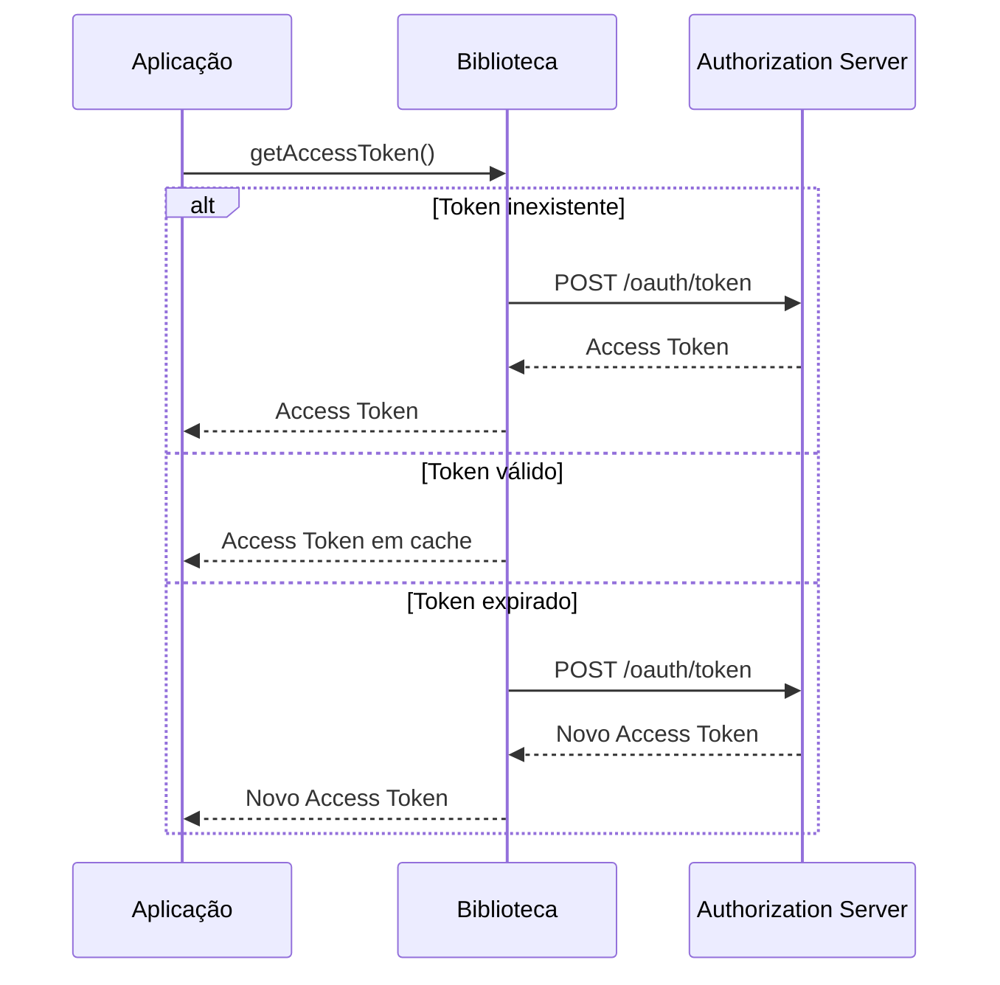

# MarhaSoft OAuth Client Spring Boot Starter

Spring Boot Starter para integração automática com Authorization Servers OAuth 2.0 utilizando o fluxo **Client Credentials**.

A biblioteca elimina a necessidade de configurar manualmente o Spring Security OAuth Client, fornecendo uma integração simples e padronizada para obtenção, reutilização e renovação automática de Access Tokens.

---

# Funcionalidades

- Auto Configuration para Spring Boot
- Configuração automática do OAuth 2.0 Client
- Suporte ao fluxo **Client Credentials**
- Gerenciamento automático de Access Tokens
- Reutilização automática de Access Tokens válidos
- Renovação automática de Access Tokens expirados
- Integração com `RestClient`
- Configuração através de `@ConfigurationProperties`
- Validação das propriedades obrigatórias (_Fail Fast_)
- Tratamento de exceções com mensagens amigáveis
- Testes unitários
- Testes de Auto Configuration

---

# Requisitos

- Java 21+
- Spring Boot 4.x

---

# Instalação

Enquanto a biblioteca não estiver publicada em um repositório Maven remoto, execute:

```bash
mvn clean install
```

Isso instalará a biblioteca no repositório Maven local (`~/.m2/repository`).

Depois adicione a dependência ao projeto:

```xml
<dependency>
    <groupId>br.com.marhasoft</groupId>
    <artifactId>spring-boot-starter-oauth-client</artifactId>
    <version>0.0.1-SNAPSHOT</version>
</dependency>
```

---

# Configuração

Configure as propriedades da biblioteca no `application.yml`:

```yaml
marhasoft:
  oauth:
    enabled: true
    server-url: https://oauth.example.com
    client:
      id: my-client
      secret: my-secret
```

| Propriedade | Obrigatória | Descrição |
|-------------|:----------:|-----------|
| `marhasoft.oauth.enabled` | Não | Habilita ou desabilita a biblioteca. |
| `marhasoft.oauth.server-url` | Sim | URL base do Authorization Server. |
| `marhasoft.oauth.client.id` | Sim | Client ID utilizado na autenticação. |
| `marhasoft.oauth.client.secret` | Sim | Client Secret utilizado na autenticação. |

---

# Utilização

Após configurar a biblioteca, basta injetar o serviço `AccessTokenService`.

```java
@Service
public class ExampleService {

    private final AccessTokenService accessTokenService;

    public ExampleService(AccessTokenService accessTokenService) {
        this.accessTokenService = accessTokenService;
    }

    public void execute() {

        String accessToken = accessTokenService.getAccessToken();

        // Utilize o Access Token conforme necessário.

    }

}
```

---

# Como funciona

Durante a inicialização da aplicação, a biblioteca:

1. Lê as propriedades configuradas.
2. Configura automaticamente o cliente OAuth 2.0.
3. Registra os componentes necessários do Spring Security.
4. Solicita automaticamente um Access Token quando necessário.
5. Reutiliza automaticamente Access Tokens válidos.
6. Solicita automaticamente um novo Access Token quando o token atual expira.

Todo o gerenciamento do ciclo de vida do Access Token é realizado automaticamente pela biblioteca.

---

# Tratamento de erros

Todas as falhas relacionadas ao processo de autenticação OAuth são encapsuladas em uma `OAuthClientException`.

## Exemplo

```java
try {

    String token = accessTokenService.getAccessToken();

} catch (OAuthClientException ex) {

    // Trate a exceção conforme necessário.

}
```

## Cenários tratados

A biblioteca traduz automaticamente os principais cenários de erro:

| Cenário | Mensagem |
|----------|----------|
| Client ID ou Client Secret inválidos | Falha na autenticação do cliente OAuth. Verifique o Client ID e o Client Secret. |
| Authorization Server indisponível | Não foi possível conectar ao Authorization Server. Verifique se o servidor está disponível. |
| Resposta inesperada do Authorization Server | O Authorization Server retornou uma resposta inesperada ao solicitar o Access Token. Verifique os logs do Authorization Server para mais detalhes. |
| Outros erros | Erro ao obter o Access Token do Authorization Server. |

---

# Estrutura do Projeto

```text
br.com.marhasoft.oauth.client
├── api
├── auth
├── autoconfigure
├── config
├── exception
├── interceptor
├── internal
└── properties
```

---

# Primeira Versão

A primeira versão da biblioteca contempla:

- Auto Configuration
- Configuration Properties
- OAuth 2.0 Client Credentials
- Gerenciamento automático de Access Tokens
- Reutilização automática de Access Tokens
- Renovação automática de Access Tokens expirados
- Integração com `RestClient`
- Tratamento de exceções
- Testes unitários
- Testes de Auto Configuration
- Documentação inicial

---

# Roadmap

Funcionalidades planejadas para as próximas versões:

- Suporte a múltiplos clientes OAuth
- Retry configurável
- Timeout configurável
- Observabilidade com Micrometer
- Configuração de Proxy HTTP
- Customização do `RestClient`
- Exemplos completos de utilização
- Integração com WireMock para testes

---

---

# Fluxo de Funcionamento




# Licença

Este projeto é distribuído conforme a licença definida neste repositório.