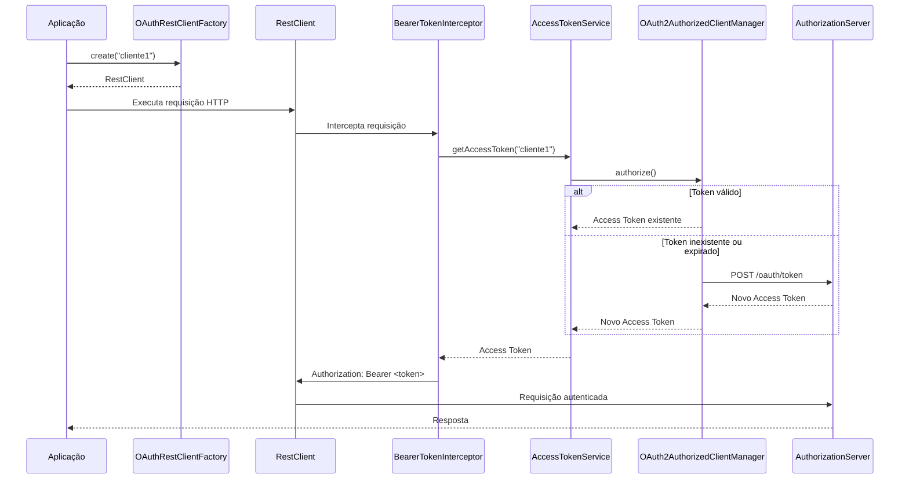

# MarhaSoft OAuth Client Spring Boot Starter

MarhaSoft OAuth Client é um Spring Boot Starter para integração com Authorization Servers OAuth 2.0 utilizando o fluxo **Client Credentials**.

A biblioteca configura automaticamente toda a infraestrutura necessária do Spring Security OAuth Client, permitindo que aplicações obtenham, reutilizem e renovem Access Tokens de forma transparente, além de fornecer um `RestClient` autenticado automaticamente.

Spring Boot Starter para integração automática com Authorization Servers OAuth 2.0 utilizando o fluxo **Client Credentials**.

A biblioteca abstrai toda a configuração do Spring Security OAuth Client, permitindo que aplicações obtenham, reutilizem e renovem automaticamente Access Tokens sem a necessidade de implementar manualmente a autenticação OAuth 2.0.

Além da configuração tradicional com um único cliente OAuth, a biblioteca também oferece suporte nativo a **múltiplos clientes**, permitindo que uma mesma aplicação consuma diferentes APIs utilizando credenciais distintas.

---

## Índice

- [Visão Geral](#visão-geral)
- [Principais Funcionalidades](#principais-funcionalidades)
- [Requisitos](#requisitos)
- [Instalação](#instalação)
- [Configuração](#configuração)
  - [Cliente Único](#cliente-único)
  - [Múltiplos Clientes](#múltiplos-clientes)
- [Obtendo Access Tokens](#obtendo-access-tokens)
- [Utilizando o OAuthRestClientFactory](#utilizando-o-oauthrestclientfactory)
- [Como funciona internamente](#como-funciona-internamente)
- [Tratamento de erros](#tratamento-de-erros)
- [Compatibilidade](#compatibilidade)
- [Estrutura do projeto](#estrutura-do-projeto)
- [Roadmap](#roadmap)
- [Licença](#licença)

---

# Visão Geral

Integrar aplicações com Authorization Servers OAuth 2.0 normalmente exige diversas configurações do Spring Security, incluindo:

- configuração do `ClientRegistration`;
- criação do `OAuth2AuthorizedClientManager`;
- gerenciamento de Access Tokens;
- renovação automática dos tokens expirados;
- inclusão manual do cabeçalho `Authorization`;
- tratamento de erros durante o processo de autenticação.

Esta biblioteca encapsula toda essa infraestrutura em um Spring Boot Starter, disponibilizando apenas dois componentes principais:

- `AccessTokenService`, responsável pela obtenção de Access Tokens.
- `OAuthRestClientFactory`, responsável por criar instâncias de `RestClient` autenticadas automaticamente.

Dessa forma, a aplicação consumidora precisa apenas configurar os clientes OAuth e começar a consumir APIs protegidas.

---

# Principais Funcionalidades

- Auto Configuration para Spring Boot
- Configuração automática do Spring Security OAuth Client
- Suporte ao fluxo **OAuth 2.0 Client Credentials**
- Suporte a cliente único
- Suporte a múltiplos clientes OAuth
- Compatibilidade com versões anteriores da biblioteca
- Gerenciamento automático de Access Tokens
- Reutilização automática de tokens válidos
- Renovação automática de tokens expirados
- RestClient autenticado automaticamente
- Inclusão automática do Bearer Token em todas as requisições
- Cache interno de instâncias do RestClient
- Configuração através de `application.yml`
- Validação automática das propriedades obrigatórias
- Tratamento padronizado de exceções
- Testes unitários
- Testes de Auto Configuration

---

# Requisitos

Para utilizar a biblioteca são necessários:

- Java 21 ou superior
- Spring Boot 3.5+

---

# Instalação

Enquanto a biblioteca não estiver publicada em um repositório Maven remoto, execute o comando abaixo para instalá-la no repositório Maven local.

```bash
mvn clean install
```

Após a instalação, adicione a dependência ao projeto consumidor.

```xml
<dependency>
    <groupId>br.com.marhasoft</groupId>
    <artifactId>spring-boot-starter-oauth-client</artifactId>
    <version>0.0.1-SNAPSHOT</version>
</dependency>
```

---

# Configuração

A biblioteca suporta dois modelos de configuração:

- Cliente OAuth único;
- Múltiplos clientes OAuth.

Caso apenas um cliente seja necessário, a configuração tradicional continua funcionando normalmente.

Quando a aplicação precisar consumir APIs utilizando diferentes credenciais OAuth, basta utilizar a configuração com múltiplos clientes.

> **Recomendação**
>
> Utilize a configuração com múltiplos clientes sempre que a aplicação consumir mais de uma API protegida por OAuth 2.0.

---

## Cliente Único

A configuração abaixo está disponível para aplicações que utilizam apenas um cliente OAuth.

```yaml
marhasoft:
  oauth:
    enabled: true
    server-url: https://oauth.example.com

    client:
      id: my-client
      secret: my-secret
```

### Propriedades

| Propriedade | Obrigatória | Descrição |
|-------------|:----------:|-----------|
| `enabled` | Não | Habilita ou desabilita a biblioteca. |
| `server-url` | Sim | URL base do Authorization Server. |
| `client.id` | Sim | Client ID utilizado para autenticação. |
| `client.secret` | Sim | Client Secret utilizado para autenticação. |

---

## Múltiplos Clientes

Quando uma aplicação precisa consumir diferentes serviços protegidos por OAuth 2.0 utilizando credenciais distintas, basta configurar os clientes desejados.

```yaml
marhasoft:
  oauth:
    enabled: true

    server-url: https://oauth.example.com

    default-client: diligencia

    clients:

      diligencia:
        id: diligencia
        secret: secret-diligencia

      memorando:
        id: memorando
        secret: secret-memorando

      transparencia:
        id: transparencia
        secret: secret-transparencia
```

### Propriedades

| Propriedade | Obrigatória | Descrição |
|-------------|:----------:|-----------|
| `default-client` | Não | Cliente utilizado quando nenhum cliente for informado. |
| `clients` | Não | Conjunto de clientes OAuth disponíveis na aplicação. |
| `clients.<nome>.id` | Sim | Client ID do cliente configurado. |
| `clients.<nome>.secret` | Sim | Client Secret correspondente ao cliente. |

Quando o atributo `default-client` for informado, todos os componentes da biblioteca que não receberem explicitamente um cliente utilizarão automaticamente esse cliente como padrão.

---

## Compatibilidade

A biblioteca mantém compatibilidade total com a configuração utilizada nas versões anteriores.

Aplicações que utilizam apenas:

```yaml
marhasoft:
  oauth:
    client:
      id:
      secret:
```

não precisam realizar nenhuma alteração para atualizar a biblioteca.

A configuração com múltiplos clientes é opcional e pode ser adotada gradualmente conforme a necessidade da aplicação.

---

# Utilizando o OAuthRestClientFactory

A biblioteca disponibiliza o `OAuthRestClientFactory`, responsável por criar instâncias de `RestClient` configuradas automaticamente para autenticação OAuth 2.0.

Ao utilizar esse componente, a aplicação não precisa se preocupar em:

- solicitar um Access Token;
- controlar a expiração do token;
- renovar tokens expirados;
- adicionar manualmente o cabeçalho `Authorization`.

Todo esse processo é realizado automaticamente pela biblioteca.

---

## Cliente padrão

Quando um `default-client` estiver configurado, basta utilizar o método `create()`.

```java
@Service
public class VeiculoService {

    private final RestClient restClient;

    public VeiculoService(OAuthRestClientFactory factory) {
        this.restClient = factory.create();
    }

    public List<VeiculoDTO> listar() {

        return restClient.get()
                .uri("https://api.exemplo.com/veiculos")
                .retrieve()
                .body(new ParameterizedTypeReference<>() {});

    }

}
```

Nesse caso, o `RestClient` utilizará automaticamente o cliente definido em `default-client`.

---

## Cliente específico

Quando a aplicação possuir múltiplos clientes OAuth configurados, basta informar o nome do cliente desejado.

```java
@Service
public class IntegracaoService {

    private final OAuthRestClientFactory factory;

    public IntegracaoService(OAuthRestClientFactory factory) {
        this.factory = factory;
    }

    public void enviarVeiculos(VeiculoDTO dto) {

        factory.create("cliente1")
                .post()
                .uri("https://api.exemplo.com/veiculos")
                .body(dto)
                .retrieve()
                .toBodilessEntity();

    }

    public void enviarProprietarios(ProprietarioDTO dto) {

        factory.create("cliente2")
                .post()
                .uri("https://api.exemplo.com/proprietarios")
                .body(dto)
                .retrieve()
                .toBodilessEntity();

    }

}
```

Cada cliente possui seu próprio gerenciamento de Access Token.

Isso significa que tokens de clientes diferentes são obtidos, reutilizados e renovados de forma independente.

---

## Reutilização de instâncias

As instâncias de `RestClient` são mantidas internamente pela biblioteca.

Chamadas sucessivas para o mesmo cliente retornam a mesma instância.

```java
RestClient primeiro = factory.create("marhashoft");

RestClient segundo = factory.create("marhashoft");

// true
primeiro == segundo;
```

Esse comportamento evita a criação desnecessária de objetos e melhora o desempenho da aplicação.

---

## O que acontece automaticamente

Sempre que uma requisição é realizada utilizando um `RestClient` criado pela biblioteca, o seguinte fluxo acontece automaticamente:

1. Verifica se existe um Access Token válido para o cliente.
2. Caso não exista, solicita um novo Access Token ao Authorization Server.
3. Caso exista e ainda esteja válido, reutiliza o token existente.
4. Caso o token tenha expirado, solicita automaticamente um novo.
5. Adiciona o cabeçalho `Authorization: Bearer <token>` à requisição.
6. Executa a chamada HTTP.

Todo esse processo é transparente para a aplicação consumidora.

# Obtendo Access Tokens Manualmente

Embora a forma recomendada de consumir APIs protegidas seja através do `OAuthRestClientFactory`, a biblioteca também disponibiliza o `AccessTokenService`.

Esse serviço é útil quando a aplicação precisa obter explicitamente um Access Token para utilizá-lo em componentes externos à biblioteca ou em clientes HTTP personalizados.

---

## Cliente padrão

Quando um `default-client` estiver configurado, basta utilizar o método `getAccessToken()`.

```java
@Service
public class ExampleService {

    private final AccessTokenService accessTokenService;

    public ExampleService(AccessTokenService accessTokenService) {
        this.accessTokenService = accessTokenService;
    }

    public void executar() {

        String accessToken = accessTokenService.getAccessToken();

        System.out.println(accessToken);

    }

}
```

Nesse caso, será utilizado automaticamente o cliente definido em `default-client`.

---

## Cliente específico

Quando a aplicação possuir múltiplos clientes OAuth configurados, basta informar o nome do cliente desejado.

```java
@Service
public class IntegracaoService {

    private final AccessTokenService accessTokenService;

    public IntegracaoService(AccessTokenService accessTokenService) {
        this.accessTokenService = accessTokenService;
    }

    public void executar() {

        String memorando =
                accessTokenService.getAccessToken("cliente1");

        String diligencia =
                accessTokenService.getAccessToken("cliente2");

    }

}
```

Cada cliente possui seu próprio ciclo de vida de Access Token.

Isso significa que tokens pertencentes a clientes diferentes são armazenados, reutilizados e renovados independentemente.

---

## Quando utilizar o AccessTokenService

O `AccessTokenService` é indicado para cenários em que o Access Token precisa ser utilizado diretamente pela aplicação, como por exemplo:

- integração com bibliotecas HTTP de terceiros;
- comunicação com APIs que não utilizam `RestClient`;
- envio manual do cabeçalho `Authorization`;
- integração com SDKs externos que exigem o Access Token.

Sempre que possível, recomenda-se utilizar o `OAuthRestClientFactory`, pois ele automatiza todo o processo de autenticação e gerenciamento do ciclo de vida dos Access Tokens.

---

## Gerenciamento automático de Tokens

O `AccessTokenService` delega ao Spring Security o gerenciamento do ciclo de vida dos Access Tokens.

Sempre que um token é solicitado, a biblioteca garante que um Access Token válido seja retornado, reutilizando tokens existentes ou obtendo automaticamente um novo quando necessário.

Esse comportamento é totalmente transparente para o consumidor da biblioteca.

# Como funciona internamente

A biblioteca encapsula toda a infraestrutura necessária para autenticação OAuth 2.0 utilizando o fluxo **Client Credentials**.

Durante a inicialização da aplicação, todos os componentes necessários são registrados automaticamente através da Auto Configuration do Spring Boot.

O consumidor da biblioteca precisa apenas adicionar a dependência, configurar os clientes OAuth e utilizar os componentes disponibilizados.

---

## Inicialização

Durante o processo de inicialização da aplicação, a biblioteca executa as seguintes etapas:

1. Lê as propriedades configuradas em `application.yml`.
2. Valida as propriedades obrigatórias.
3. Cria um `ClientRegistration` para cada cliente configurado.
4. Registra um `ClientRegistrationRepository`.
5. Configura o `OAuth2AuthorizedClientService`.
6. Configura o `OAuth2AuthorizedClientProvider`.
7. Cria o `OAuth2AuthorizedClientManager`.
8. Disponibiliza o `AccessTokenService`.
9. Disponibiliza o `OAuthRestClientFactory`.

Após essa etapa, a biblioteca está pronta para autenticar automaticamente todas as chamadas realizadas pela aplicação.

---

## Solicitação de Access Token

Sempre que um Access Token é solicitado, a biblioteca executa automaticamente o seguinte fluxo:

1. Identifica qual cliente OAuth deve ser utilizado.
2. Solicita ao Spring Security um `OAuth2AuthorizedClient`.
3. Caso não exista um token válido, o Spring Security realiza uma requisição ao Authorization Server.
4. O Access Token retornado é armazenado pelo Spring Security.
5. O token é devolvido à aplicação.

Todo esse processo é transparente para o consumidor da biblioteca.

---

## Reutilização de Tokens

A biblioteca utiliza o mecanismo de gerenciamento de tokens fornecido pelo Spring Security.

Quando um Access Token ainda está dentro do seu período de validade, ele é reutilizado automaticamente, evitando chamadas desnecessárias ao Authorization Server.

Esse comportamento reduz a quantidade de autenticações realizadas e melhora o desempenho da aplicação.

---

## Renovação Automática

Quando um Access Token expira, a biblioteca solicita automaticamente um novo token ao Authorization Server.

A aplicação não precisa verificar datas de expiração nem implementar lógica de renovação.

---

## RestClient

O `OAuthRestClientFactory` cria instâncias de `RestClient` configuradas com um interceptor responsável por incluir automaticamente o cabeçalho:

```http
Authorization: Bearer <access-token>
```

Antes de cada requisição, o interceptor obtém um Access Token válido através do `AccessTokenService`.

Caso o token existente tenha expirado, um novo será solicitado automaticamente.

---

## Suporte a múltiplos clientes

Cada cliente OAuth configurado possui seu próprio gerenciamento de autenticação.

Isso significa que:

- cada cliente possui seu próprio Access Token;
- tokens são reutilizados independentemente;
- tokens são renovados individualmente;
- cada `RestClient` é associado ao cliente utilizado para sua criação.

Dessa forma, uma mesma aplicação pode consumir diferentes APIs protegidas utilizando credenciais distintas, sem necessidade de configurações adicionais.

---

# Tratamento de Erros

Todas as falhas relacionadas ao processo de autenticação OAuth são encapsuladas em uma única exceção: `OAuthClientException`.

O objetivo é abstrair as exceções específicas do Spring Security OAuth e fornecer mensagens mais claras para a aplicação consumidora.

---

## Exemplo

```java
@Service
public class ExampleService {

    private final AccessTokenService accessTokenService;

    public ExampleService(AccessTokenService accessTokenService) {
        this.accessTokenService = accessTokenService;
    }

    public void executar() {

        try {

            String token =
                    accessTokenService.getAccessToken();

            System.out.println(token);

        } catch (OAuthClientException ex) {

            System.out.println(ex.getMessage());

        }

    }

}
```

---

## Cenários tratados

A biblioteca traduz automaticamente os principais erros retornados pelo Authorization Server ou pelo Spring Security.

| Cenário | Exceção |
|----------|----------|
| Client ID ou Client Secret inválidos | `OAuthClientException` |
| Authorization Server indisponível | `OAuthClientException` |
| Resposta inesperada do Authorization Server | `OAuthClientException` |
| Falha durante a obtenção do Access Token | `OAuthClientException` |

---

## Mensagens retornadas

As mensagens são padronizadas para facilitar o tratamento pela aplicação consumidora.

| Situação | Mensagem |
|----------|----------|
| Client ID ou Client Secret inválidos | Falha na autenticação do cliente OAuth. Verifique o Client ID e o Client Secret. |
| Authorization Server indisponível | Não foi possível conectar ao Authorization Server. Verifique se o servidor está disponível. |
| Resposta inesperada | O Authorization Server retornou uma resposta inesperada ao solicitar o Access Token. Verifique os logs do Authorization Server para mais detalhes. |
| Outros erros | Erro ao obter o Access Token do Authorization Server. |

---

## Benefícios

Ao encapsular as exceções internas do Spring Security, a biblioteca oferece diversas vantagens:

- desacoplamento da implementação do Spring Security;
- mensagens padronizadas para todas as aplicações;
- menor dependência das exceções internas do framework;
- maior facilidade para tratamento de erros;
- possibilidade de evolução da implementação interna sem impactar aplicações consumidoras.

# Estrutura do Projeto

A biblioteca está organizada em módulos com responsabilidades bem definidas.

```text
br.com.marhasoft.oauth.client
├── api
│   ├── AccessTokenService
│   └── OAuthRestClientFactory
│
├── auth
│   └── ClientAuthentication
│
├── autoconfigure
│   └── OAuthClientAutoConfiguration
│
├── config
│   ├── OAuthClientConfiguration
│   └── RestClientConfiguration
│
├── exception
│   ├── OAuthClientException
│   └── OAuthClientExceptionHandler
│
├── interceptor
│   └── BearerTokenInterceptor
│
├── internal
│   ├── DefaultAccessTokenService
│   ├── DefaultOAuthRestClientFactory
│   └── OAuthClientConstants
│
└── properties
    └── OAuthClientProperties
```

## Organização dos Pacotes

| Pacote | Responsabilidade |
|---------|------------------|
| `api` | Interfaces públicas disponibilizadas para aplicações consumidoras. |
| `auth` | Componentes relacionados ao processo de autenticação OAuth. |
| `autoconfigure` | Auto Configuration responsável por registrar automaticamente os componentes da biblioteca. |
| `config` | Configuração da infraestrutura OAuth e do RestClient. |
| `exception` | Exceções públicas e tratamento centralizado de erros. |
| `interceptor` | Interceptadores responsáveis por adicionar o Bearer Token nas requisições HTTP. |
| `internal` | Implementações internas da biblioteca. |
| `properties` | Classes responsáveis pelo mapeamento das propriedades do `application.yml`. |

Apenas as interfaces presentes no pacote `api` devem ser utilizadas diretamente pelas aplicações consumidoras. Os demais pacotes fazem parte da implementação interna da biblioteca e podem evoluir sem impacto na API pública.

---

# Fluxo de Funcionamento

O diagrama abaixo ilustra o fluxo completo de autenticação realizado automaticamente pela biblioteca.



---

## Resumo do Fluxo

1. A aplicação solicita um `RestClient`.
2. O `OAuthRestClientFactory` fornece uma instância configurada para o cliente informado.
3. Antes de cada requisição, o `BearerTokenInterceptor` é executado.
4. O interceptor solicita um Access Token ao `AccessTokenService`.
5. O `AccessTokenService` utiliza o `OAuth2AuthorizedClientManager` para obter um token válido.
6. Caso necessário, um novo Access Token é solicitado ao Authorization Server.
7. O cabeçalho `Authorization: Bearer <token>` é adicionado automaticamente.
8. A requisição é enviada para a API protegida.

Todo esse processo ocorre de forma transparente para a aplicação consumidora.

---

# Roadmap

As próximas versões da biblioteca poderão incluir novos recursos para ampliar sua flexibilidade e observabilidade.

Entre as funcionalidades planejadas estão:

- Retry configurável para obtenção de Access Tokens.
- Timeout configurável para comunicação com o Authorization Server.
- Configuração de Proxy HTTP.
- Observabilidade utilizando Micrometer.
- Integração com OpenTelemetry.
- Métricas de autenticação.
- Customização do `RestClient`.
- Suporte a filtros/interceptadores personalizados.
- Exemplos completos de integração.
- Testes de integração utilizando WireMock.

As funcionalidades serão adicionadas mantendo compatibilidade com a API pública da biblioteca sempre que possível.

---

# Licença

Este projeto é distribuído conforme a licença definida neste repositório.

---

## Contribuições

Contribuições são bem-vindas.

Caso encontre algum problema ou tenha sugestões de melhoria, fique à vontade para abrir uma *Issue* ou enviar um *Pull Request*.

Toda contribuição será analisada e discutida antes de sua incorporação ao projeto.